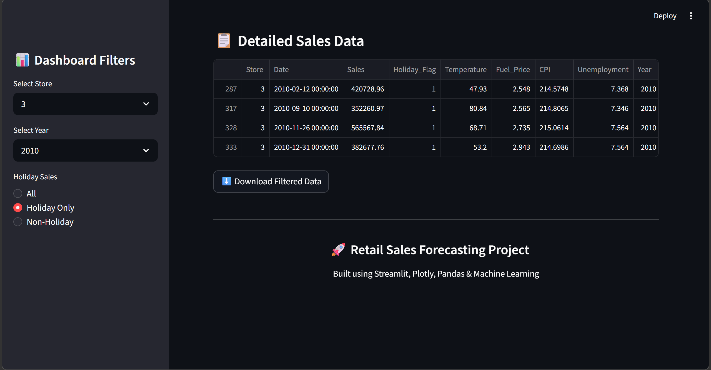
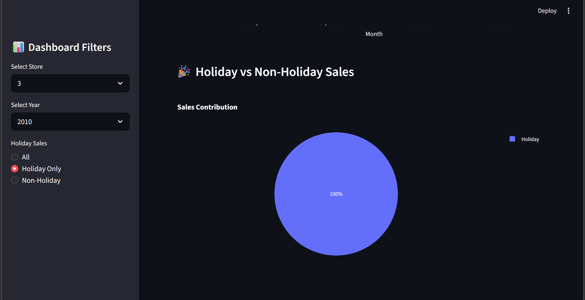
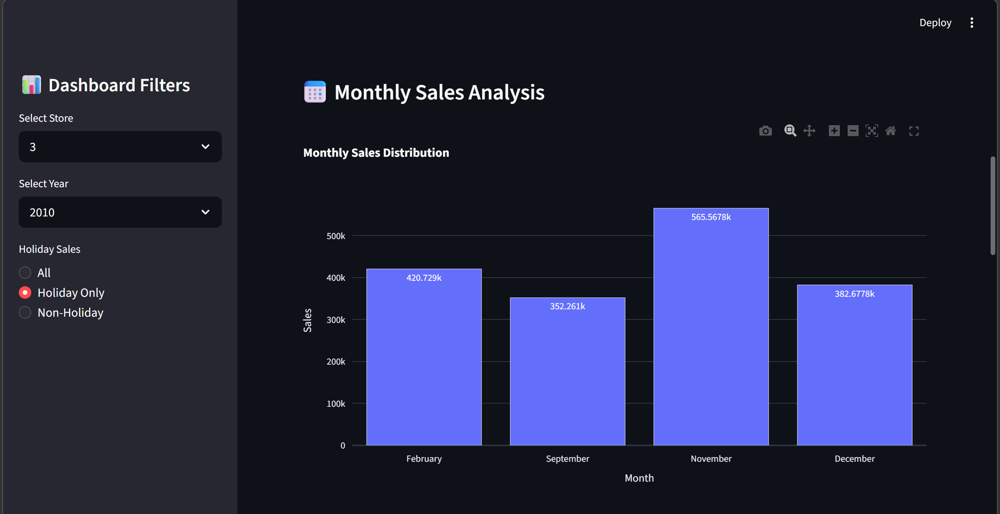

# 📈 Retail Sales Forecasting Dashboard

A professional machine learning and business analytics project built using Python, Streamlit, Plotly, and XGBoost to analyze and forecast retail sales using real-world Walmart sales data.

---

# 🚀 Project Overview

This project focuses on analyzing retail sales trends and building an interactive dashboard for business insights and forecasting.

The dashboard allows users to:

* Analyze weekly sales trends
* Filter data by store and year
* View KPI business metrics
* Compare holiday and non-holiday sales
* Visualize monthly sales performance
* Download filtered datasets

This project simulates a real-world retail analytics application.

---

# 🛠 Technologies Used

* Python
* Pandas
* NumPy
* Matplotlib
* Plotly
* Streamlit
* Scikit-learn
* XGBoost

---

# 📊 Features

✅ Interactive Streamlit Dashboard

✅ KPI Cards for Business Metrics

✅ Weekly & Monthly Sales Analysis

✅ Holiday vs Non-Holiday Sales Insights

✅ Interactive Plotly Visualizations

✅ Data Filtering Options

✅ Download Filtered Data Option

✅ Machine Learning-Based Sales Forecasting

---

# 📂 Project Structure

```bash
Retail_Sales_Project
│
├── app.py
├── sales_forecasting.py
├── sales_data.csv
├── sales_predictions.csv
├── requirements.txt
├── README.md
│
├── images
│   ├── dashboard.png
│   ├── Detailed_sales data.png
│   ├── Sales_Contribution.png
│   ├── Monthly_sales_tredns.png
│   └── Weekly__sales_trends.png
```

---

# 📸 Dashboard Screenshots

## 🖥️ Full Dashboard


---

## 📈 Detailed sales data



---

## 🎯Sales Contribution



---

## 📅 Monthly Sales Analysis



---

## 🔍 Weekly sales trends


---

# ⭐ Future Improvements

* Future Sales Forecasting
* Advanced Time Series Models
* Real-Time Data Integration
* User Authentication
* Advanced Business Analytics

---

# 🙌 Acknowledgements

Dataset: Walmart Retail Sales Dataset
